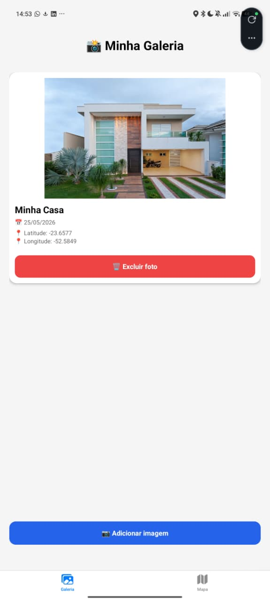

# Projeto Galeria de Fotos com Mapa e SQLite

Este projeto foi desenvolvido utilizando **React Native com Expo** como parte da disciplina de Desenvolvimento Mobile.

O aplicativo permite cadastrar imagens da galeria do dispositivo, armazenar informações no banco SQLite local e visualizar a localização das imagens em um mapa interativo.

---

## Funcionalidades

✅ Adicionar imagem pela galeria do dispositivo
✅ Inserir título para cada imagem
✅ Capturar localização atual automaticamente
✅ Salvar dados localmente com SQLite
✅ Exibir galeria de imagens
✅ Exibir mapa com marcadores
✅ Exibir miniatura ao tocar no marcador
✅ Excluir imagens da galeria
✅ Persistência de dados após fechar o aplicativo
✅ Interface personalizada

---

## Tecnologias Utilizadas

* React Native
* Expo
* TypeScript
* SQLite
* Expo Image Picker
* Expo Location
* React Native Maps
* Expo Router

---

## Bibliotecas utilizadas

Instalação das dependências:

```bash
npx expo install expo-sqlite
npx expo install expo-image-picker
npx expo install expo-location
npx expo install react-native-maps
npx expo install react-native-safe-area-context
```

ou:

```bash
npx expo install expo-sqlite expo-image-picker expo-location react-native-maps react-native-safe-area-context
```

---

## Estrutura do Banco de Dados

Tabela utilizada:

```sql
CREATE TABLE IF NOT EXISTS photos (
  id INTEGER PRIMARY KEY AUTOINCREMENT,
  title TEXT NOT NULL,
  image_uri TEXT NOT NULL,
  latitude REAL,
  longitude REAL,
  created_at TEXT NOT NULL
);
```

---

## Estrutura do Projeto

```txt
app
 ├── (tabs)
 │     ├── index.tsx
 │     ├── explore.tsx
 │     └── _layout.tsx
 │
database
 └── database.ts
```

---

## Fluxo da Aplicação

```txt
Usuário abre o aplicativo
↓
Seleciona uma imagem
↓
Visualiza a prévia
↓
Informa o título
↓
Aplicativo captura localização atual
↓
Imagem é salva no SQLite
↓
Galeria atualiza automaticamente
↓
Mapa exibe marcador da nova imagem
```

---

## Como executar o projeto

Clonar o repositório:

```bash
git clone https://github.com/carlos-hferro/galeria-fotos.git
```

Entrar na pasta:

```bash
cd galeria-fotos
```

Instalar dependências:

```bash
npm install
```

Executar:

```bash
npx expo start
```

Para abrir:

```txt
Pressione "a" → Android
Pressione "w" → Web
ou leia o QR Code com Expo Go
```

---

## Funcionalidades demonstradas

### Galeria

* Cadastro de imagem
* Título personalizado
* Exclusão com confirmação
* Persistência local

### Mapa

* Marcadores automáticos
* Exibição da localização
* Miniatura da imagem
* Data e hora do registro

---

## Capturas de Tela

### Galeria




### Mapa


### Detalhes do Mapa


---
## Autor

Carlos Henrique Ferro de Almeida

Curso: Desenvolvimento Mobile  
Universidade: UNIPAR  
Disciplina: Desenvolvimento Mobile

---

## Observações

- O aplicativo utiliza SQLite para armazenamento local.
- Os dados permanecem salvos após fechar o aplicativo.
- A localização é capturada automaticamente no momento do cadastro.
- O mapa exibe marcadores com miniatura e informações da imagem.
  
--- 
