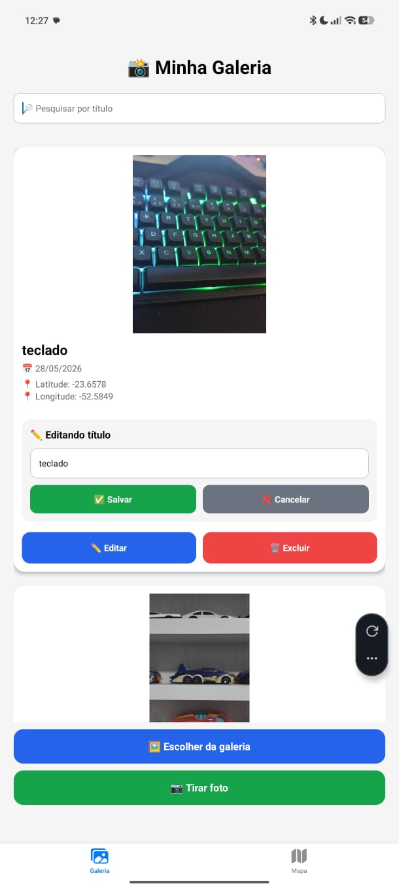
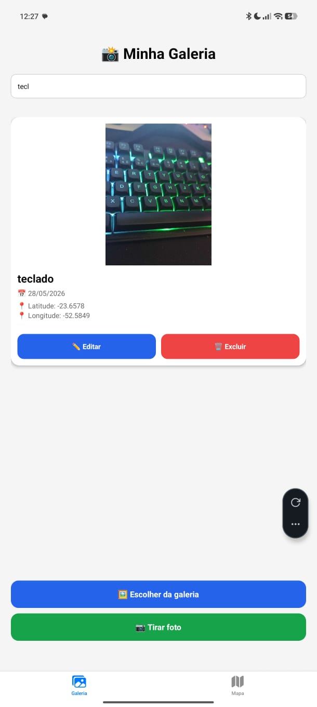
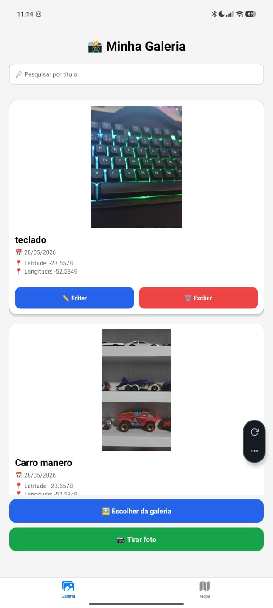
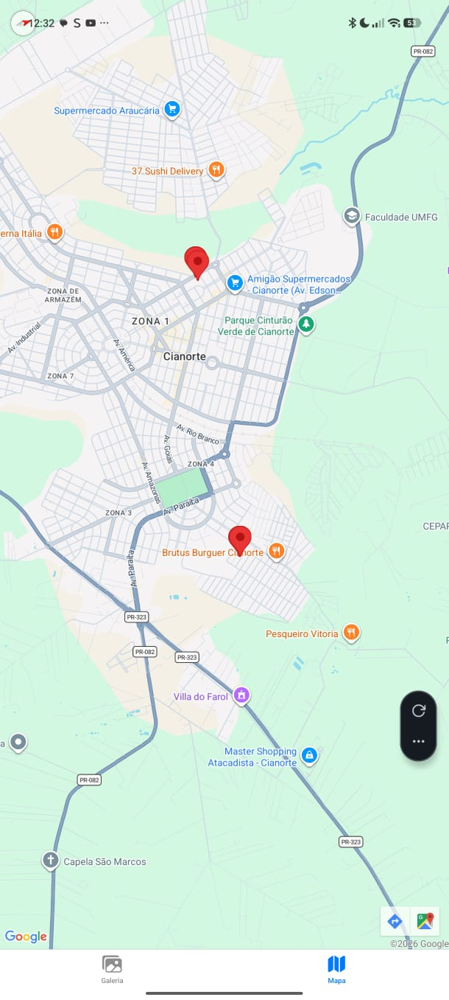
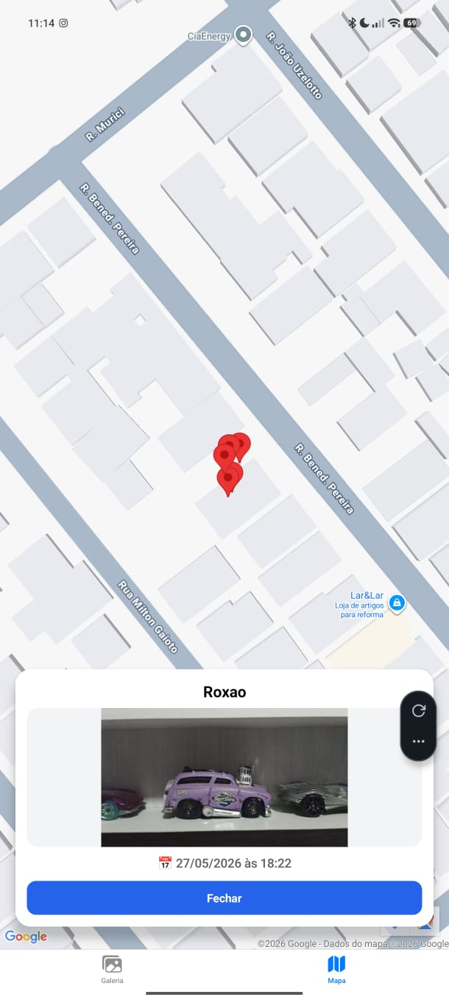

# Projeto Galeria de Fotos com Mapa e SQLite

Aplicativo mobile desenvolvido com **React Native + Expo**, utilizando **SQLite**, **geolocalização**, **galeria/câmera** e **mapa interativo**.

O objetivo do projeto é permitir o cadastro de imagens com título e localização, armazenando os dados localmente no dispositivo e exibindo as imagens em uma galeria e em um mapa com marcadores.

---

## Funcionalidades

- Adicionar imagem pela galeria do dispositivo
- Tirar foto usando a câmera
- Visualizar prévia antes de salvar
- Inserir título para cada imagem
- Capturar localização atual automaticamente
- Salvar dados localmente com SQLite
- Listar imagens cadastradas em uma galeria
- Pesquisar imagens pelo título
- Renomear título de imagens salvas
- Excluir imagens com confirmação
- Exibir mapa com marcadores das imagens
- Ao tocar no marcador, exibir detalhes com miniatura, título, data e hora
- Persistência dos dados após fechar o aplicativo
- Interface personalizada com componentes reutilizáveis

---

## Tecnologias Utilizadas

- React Native
- Expo
- TypeScript
- Expo Router
- Expo SQLite
- Expo Image Picker
- Expo Location
- React Native Maps
- React Native Safe Area Context

---

## Instalação das dependências

```bash
npm install
```

Caso seja necessário instalar manualmente as bibliotecas principais:

```bash
npx expo install expo-sqlite expo-image-picker expo-location react-native-maps react-native-safe-area-context
```

---

## Como executar o projeto

Clone o repositório:

```bash
git clone https://github.com/carlos-hferro/galeria-fotos.git
```

Entre na pasta do projeto:

```bash
cd galeria-fotos
```

Instale as dependências:

```bash
npm install
```

Execute o projeto:

```bash
npx expo start
```

Depois, abra com o **Expo Go** no celular lendo o QR Code.

> Observação: a versão Web pode apresentar limitações com `react-native-maps`, por isso o teste principal deve ser feito no dispositivo móvel ou em emulador Android.

---

## Estrutura do Banco de Dados

Tabela utilizada: `photos`

```sql
CREATE TABLE IF NOT EXISTS photos (
  id INTEGER PRIMARY KEY AUTOINCREMENT,
  title TEXT NOT NULL,
  image_uri TEXT NOT NULL,
  latitude REAL,
  longitude REAL,
  created_at TEXT NOT NULL
);
```

Campos armazenados:

- `id`: identificador único da imagem
- `title`: título informado pelo usuário
- `image_uri`: URI local da imagem
- `latitude`: latitude capturada no momento do cadastro
- `longitude`: longitude capturada no momento do cadastro
- `created_at`: data e hora do cadastro

---

## Estrutura do Projeto

```txt
app
 ├── (tabs)
 │    ├── index.tsx
 │    ├── explore.tsx
 │    └── _layout.tsx
 └── _layout.tsx

components
 ├── ActionButtons.tsx
 ├── PhotoCard.tsx
 ├── PhotoPreview.tsx
 └── SearchBar.tsx

database
 └── database.ts

types
 └── Photo.ts

screenshots
 ├── galeria.png
 ├── mapa.png
 └── detalhes.png
```

---

## Organização do Código

O projeto foi separado em responsabilidades:

- `app/(tabs)/index.tsx`: tela principal da galeria
- `app/(tabs)/explore.tsx`: tela do mapa
- `components/`: componentes reutilizáveis da interface
- `database/database.ts`: criação da tabela e funções SQLite
- `types/Photo.ts`: tipagem dos dados das fotos
- `screenshots/`: imagens utilizadas no README

Essa organização facilita manutenção, leitura e reaproveitamento de código.

---

## Fluxo da Aplicação

```txt
Usuário abre o aplicativo
↓
Escolhe imagem da galeria ou tira uma foto
↓
Visualiza a prévia da imagem
↓
Informa o título
↓
Aplicativo captura a localização atual
↓
Imagem é salva no SQLite
↓
Galeria atualiza automaticamente
↓
Mapa exibe marcador da nova imagem
↓
Ao tocar no marcador, detalhes da imagem são exibidos
```

---

## Capturas de Tela

### Galeria





### Mapa




---

## Funcionalidades Demonstradas

### Galeria

- Cadastro de imagens
- Pré-visualização antes de salvar
- Título personalizado
- Pesquisa por título
- Renomear imagem
- Exclusão com confirmação
- Persistência local

### Mapa

- Marcadores automáticos
- Integração com latitude e longitude
- Detalhes da imagem ao tocar no marcador
- Miniatura, título, data e hora

---

## Autor

Carlos Henrique Ferro de Almeida  
Curso: Desenvolvimento Mobile  
Universidade: UNIPAR  
Disciplina: Desenvolvimento Mobile

---

## Observações

- O armazenamento é local utilizando SQLite.
- As informações permanecem salvas após fechar o aplicativo.
- A localização é capturada no momento do cadastro.
- O aplicativo deve ser testado preferencialmente no Expo Go ou em emulador Android.